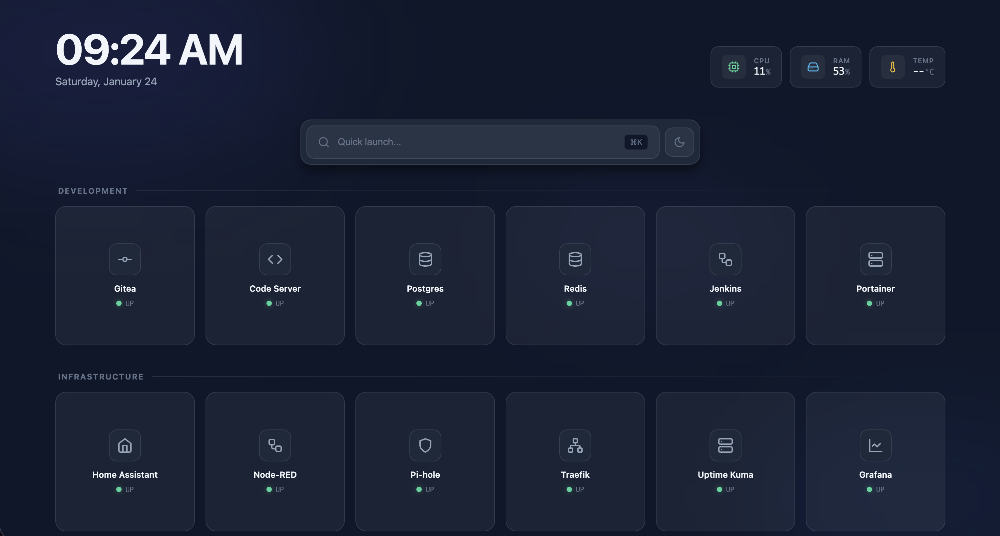

# HomeDash

A simple, self-hosted application dashboard for self-hosted applications. 
Minimal dependencies, single binary, easy configuration via YAML manifest.




## Features

- **Single binary** - Frontend embedded in Go binary, no external dependencies
- **Edit from UI** - Add/remove apps directly from the dashboard - changes saved to `apps.yaml`
- **YAML manifest** - Define your apps in a simple `apps.yaml` file
- **Auto-refresh** - Dashboard updates automatically when manifest changes
- **Health monitoring** - HTTP and TCP health checks with configurable intervals
- **Agent mode** - Monitor system stats from multiple servers
- **System stats** - CPU, RAM, and temperature monitoring
- **Dark/Light theme** - Toggle with localStorage persistence
- **Command palette** - Quick launch apps with `Cmd/Ctrl+K`
- **Responsive** - Works on desktop and mobile
- **No build step** - Vanilla HTML/CSS/JS frontend

## Quick Start

### Download and Run

#### Linux

```bash
curl -L -o homedash https://github.com/jlandersen/homedash/releases/latest/download/homedash-linux-amd64
chmod +x homedash
./homedash
```

#### macOS (Apple Silicon)

```bash
curl -L -o homedash https://github.com/jlandersen/homedash/releases/latest/download/homedash-darwin-arm64
chmod +x homedash
./homedash
```

Open http://localhost:8080 in your browser.

### Using Docker Compose

```yaml
services:
  homedash:
    image: ghcr.io/jlandersen/homedash:latest
    ports:
      - "8080:8080"
    volumes:
      - ./apps.yaml:/apps.yaml:ro
    environment:
      - HOMEDASH_MANIFEST=/apps.yaml
    restart: unless-stopped
```

Then run:
```bash
docker compose up -d
```

### Using Docker

```bash
docker pull ghcr.io/jlandersen/homedash:latest
docker run -p 8080:8080 \
  -v $(pwd)/apps.yaml:/apps.yaml:ro \
  -e HOMEDASH_MANIFEST=/apps.yaml \
  ghcr.io/jlandersen/homedash:latest
```

The image uses `scratch` (empty base) and is only ~10MB.

> **Note:** When using Docker with a bind-mounted `apps.yaml`, file change detection may not work reliably due to how Docker handles bind mounts. After editing `apps.yaml`, restart the container to apply changes: `docker compose restart`

## Configuration

### Environment Variables

| Variable | Default | Description |
|----------|---------|-------------|
| `HOMEDASH_PORT` | `8080` | Server port |
| `HOMEDASH_MANIFEST` | `./apps.yaml` | Path to manifest file |
| `HOMEDASH_CHECK_INTERVAL` | `30s` | Health check interval |
| `HOMEDASH_CHECK_TIMEOUT` | `5s` | Timeout per health check |
| `HOMEDASH_TIME_24H` | `false` | Use 24-hour time format |
| `HOMEDASH_SHOW_CPU` | `true` | Show CPU usage stat |
| `HOMEDASH_SHOW_RAM` | `true` | Show RAM usage stat |
| `HOMEDASH_SHOW_TEMP` | `true` | Show temperature stat |
| `HOMEDASH_ALLOW_EDIT` | `true` | Allow editing apps from the UI |
| `HOMEDASH_AGENT_MODE` | `false` | Run in agent mode (stats endpoint only) |
| `HOMEDASH_TLS_CERT` | - | Path to TLS certificate file |
| `HOMEDASH_TLS_KEY` | - | Path to TLS private key file |
| `HOMEDASH_TLS_REDIRECT` | - | Port for HTTP->HTTPS redirect |

Example:

```bash
HOMEDASH_PORT=3000 HOMEDASH_CHECK_INTERVAL=60s ./homedash
```

### TLS/HTTPS Support

To enable HTTPS, provide both TLS certificate and key files:

```bash
HOMEDASH_TLS_CERT=/path/to/cert.pem HOMEDASH_TLS_KEY=/path/to/key.pem ./homedash
```

To automatically redirect HTTP traffic to HTTPS, set the redirect port:

```bash
# HTTPS on 443, HTTP redirect on 80
HOMEDASH_PORT=443 HOMEDASH_TLS_CERT=cert.pem HOMEDASH_TLS_KEY=key.pem HOMEDASH_TLS_REDIRECT=80 ./homedash
```

You can generate a self-signed certificate for testing:

```bash
openssl req -x509 -newkey rsa:4096 -keyout key.pem -out cert.pem -days 365 -nodes
```

### Manifest Format (apps.yaml)

```yaml
apps:
  - name: Plex
    url: http://192.168.1.100:32400
    category: Media
    icon: film
    check_path: /web

  - name: Pi-hole
    url: http://192.168.1.1:80
    category: Network
    icon: shield
    check_type: tcp

  - name: Home Assistant
    url: http://192.168.1.50:8123
    category: Smart Home
    icon: home

# Optional: Monitor system stats from remote servers
agents:
  - name: Git Host
    url: http://192.168.1.100:8081
  - name: Docker Host
    url: http://192.168.1.200:8081
```

#### App Fields

| Field | Required | Default | Description |
|-------|----------|---------|-------------|
| `name` | Yes | - | Display name |
| `url` | Yes | - | Full URL to the application |
| `category` | No | `Uncategorized` | Group name for organizing |
| `icon` | No | `box` | Icon name (see below) |
| `check_path` | No | `/` | Path for HTTP health checks |
| `check_type` | No | `http` | `http` or `tcp` |
| `skip_check` | No | `false` | Skip health checks entirely |

#### Agent Fields

For monitoring system stats from multiple servers, add an `agents` section:

| Field | Required | Description |
|-------|----------|-------------|
| `name` | Yes | Display name for the agent |
| `url` | Yes | Full URL to the agent (e.g., `http://192.168.1.100:8081`) |

Agents must be running HomeDash in agent mode. See [Agent Mode](#agent-mode) below.

### Available Icons

| Icon | Description |
|------|-------------|
| `film` | Movie/video |
| `tv` | Television |
| `music` | Music note |
| `download` | Download arrow |
| `home` | House |
| `workflow` | Flow/nodes |
| `shield` | Shield |
| `network` | Network topology |
| `server` | Server rack |
| `database` | Database cylinder |
| `chart` | Line chart |
| `code` | Code brackets |
| `git` | Git icon |
| `terminal` | Terminal |
| `box` | Box (default) |

## Health Checks

### HTTP Checks (default)

Sends an HTTP GET request to the app URL (with optional `check_path`). 
Considers 2xx and 3xx status codes as healthy.

```yaml
- name: Plex
  url: http://192.168.1.100:32400
  check_path: /web  # Checks http://192.168.1.100:32400/web
```

### TCP Checks

Opens a TCP connection to the host and port. Useful for non-HTTP services like databases, MQTT brokers, etc.

```yaml
- name: PostgreSQL
  url: http://192.168.1.100:5432
  check_type: tcp  # Just checks if port 5432 is open
```

## API Endpoints

| Endpoint | Method | Description |
|----------|--------|-------------|
| `/` | GET | Serves the dashboard UI |
| `/api/apps` | GET | Returns JSON array of apps with status |
| `/api/config` | GET | Returns UI configuration |
| `/api/stats` | GET | Returns system stats (CPU, RAM, Temp) |
| `/api/events` | GET | SSE stream for real-time updates |

### Example Response

```json
[
  {
    "id": 1,
    "name": "Plex",
    "url": "http://192.168.1.100:32400",
    "category": "Media",
    "icon": "film",
    "status": "UP",
    "ping": "24ms"
  }
]
```

### SSE Events

The `/api/events` endpoint streams three event types:

- `config` - Sent once on connect with UI configuration
- `apps` - Sent when health check completes or manifest changes
- `stats` - Sent every 2 seconds with system statistics
- `agentstats` - Sent every 2 seconds with stats from monitored agents

## Agent Mode

Agent mode allows you to monitor system stats (CPU, RAM, Temperature) from multiple servers in a single dashboard.

### How It Works

1. **Main Dashboard Server**: Runs HomeDash normally with full UI
2. **Agent Servers**: Run HomeDash in agent mode (lightweight, stats-only)
3. **Configuration**: Add agents to your `apps.yaml`
4. **Aggregation**: Main dashboard polls agents and displays their stats

### Setting Up Agents

#### On Remote Servers (Agents)

Run HomeDash in agent mode:

```bash
# Binary
HOMEDASH_AGENT_MODE=true HOMEDASH_PORT=8081 ./homedash

# Docker
docker run -d \
  -p 8081:8081 \
  -e HOMEDASH_AGENT_MODE=true \
  -e HOMEDASH_PORT=8081 \
  ghcr.io/jlandersen/homedash:latest
```

Agent mode:
- No UI served (only `/api/stats` endpoint)
- No health checks performed
- No manifest file required
- Minimal resource usage (~5-10MB RAM)
- Returns: `{"cpu":"45","ram":"67","temp":"52"}`

#### On Main Dashboard Server

Add agents to your `apps.yaml`:

```yaml
apps:
  # Your regular apps...
  - name: Plex
    url: http://192.168.1.100:32400
    category: Media
    icon: film

# Monitor stats from remote servers
agents:
  - name: Git Host
    url: http://192.168.1.100:8081
  - name: Docker Host
    url: http://192.168.1.200:8081
  - name: NAS
    url: http://192.168.1.50:8081
```

The dashboard will:
- Poll each agent every 30 seconds
- Display stats in "Monitored Agents" section
- Show errors if agent is unreachable

### Docker Compose Example

See [docker-compose.agent.example.yml](docker-compose.agent.example.yml) for a complete multi-server setup example.

### Verifying Agent Setup

Test an agent endpoint:

```bash
curl http://192.168.1.100:8081/api/stats
# Expected output: {"cpu":"45","ram":"67","temp":"52"}
```

## Project Structure

```
homedash/
├── main.go                      # Entry point, embeds frontend
├── go.mod / go.sum              # Go module files
├── apps.yaml                    # Your application manifest
├── example.apps.yaml            # Example manifest with all options
├── internal/
│   ├── config/config.go         # Environment configuration
│   ├── manifest/manifest.go     # YAML parsing + file watcher
│   ├── health/checker.go        # HTTP/TCP health checks
│   ├── stats/stats.go           # System stats (CPU/RAM/Temp)
│   ├── agentstats/agentstats.go # Remote agent stats collector
│   └── api/handlers.go          # HTTP handlers + SSE
└── web/
    ├── index.html               # Dashboard HTML
    ├── styles.css               # Styling with dark/light themes
    └── app.js                   # Frontend JavaScript
```

## Development

```bash
# Run in development
go run .

# Build binary
go build -o homedash .

# Build for different platforms
GOOS=linux GOARCH=amd64 go build -o homedash-linux-amd64 .
GOOS=linux GOARCH=arm64 go build -o homedash-linux-arm64 .
```

## Keyboard Shortcuts

| Shortcut | Action |
|----------|--------|
| `Cmd/Ctrl + K` | Open command palette |
| `Escape` | Close command palette |
| `↑` / `↓` | Navigate results |
| `Enter` | Launch selected app |

## Credits

Inspired by [ddash](https://github.com/jsixface/ddash) - a Docker dashboard with Caddy integration.

HomeDash is a simplified alternative that:
- Doesn't require Docker or Caddy
- Uses a YAML manifest instead of Docker labels
- Has a vanilla JS frontend (no React/build step)
- Deploys as a single binary

## License

MIT License - feel free to use, modify, and distribute.
